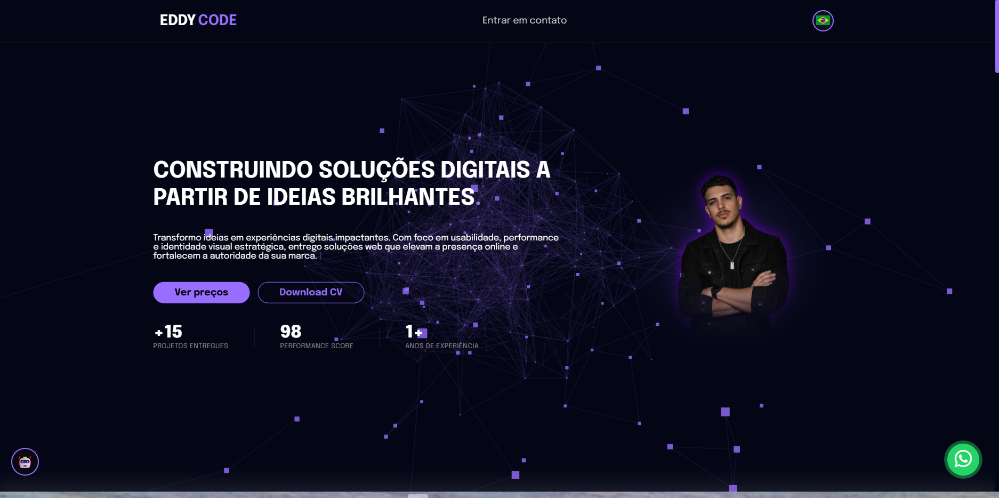

# 🚀 Portfólio | Eddy Junior

<p align="center">
  
</p>


> Um portfólio profissional e responsivo, criado para apresentar minhas habilidades como desenvolvedor Frontend e Backend, além de destacar projetos, experiências e formas de contato.

---

🎯 **Objetivo**  
Construir uma presença online sólida e impactante, oferecendo aos visitantes uma navegação clara, visual moderno e foco em performance e experiência do usuário.

🛠️ **Tecnologias utilizadas**
- HTML5 + CSS3 (SCSS)
- JavaScript (modularizado)
- Bootstrap Icons
- Google Fonts
- ScrollReveal.js

## 🧩 Instalação e Execução

Clone o repositório com o seguinte comando:

```bash
git clone https://github.com/edlesonjrr/PortifolioEddy.git
```
## 📁 Estrutura de Pastas

```bash
Portifolio/
├── assets/
│   ├── icons/                     # Ícones SVG utilizados nos cards de conhecimento
│   ├── *.jpg, *.png               # Imagens dos projetos e do perfil
│   └── edlesonCV.pdf              # Currículo disponível para download
│
├── css/                            # Arquivos CSS organizados por seção
│   ├── style.css                   # Estilo global
│   ├── about.css                   # Estilo da seção "Sobre"
│   ├── skills.css                  # Estilo da seção "Conhecimentos"
│   └── NavBar.css                  # Estilo do menu de navegação
│
├── js/                             # Scripts JavaScript
│   ├── main.js                     # Script principal com integração dos efeitos
│   ├── typeWrite.js                # Efeito de digitação
│   ├── scrollReveal.js             # Animações de rolagem
│   ├── hoverChangeDescription.js   # Interação com os cards de conhecimento
│   └── svg-inject.min.js           # Injeção de SVGs inline
│
├── scss/                           # Estilos em SCSS organizados
│   ├── _variables.scss             # Variáveis globais
│   ├── _skills.scss                # Estilo dos cards de conhecimento
│   └── _style.scss                 # Estilo base global
│
└── index.html                      # Página principal do portfólio
```

## 📌 Descrição

Este é o portfólio profissional de **Edleson Junior**, também conhecido como *Eddy*, um desenvolvedor Frontend e Backend apaixonado por criar experiências digitais impactantes.

O site apresenta de forma organizada e moderna os projetos desenvolvidos, especialidades, habilidades técnicas e informações de contato. É ideal para recrutadores, clientes e parceiros conhecerem melhor o trabalho, as competências e os serviços oferecidos como freelancer.

O design foi pensado para transmitir profissionalismo e criatividade, com foco em:
- Responsividade
- Acessibilidade
- Otimização de desempenho
- Identidade visual forte

## 🧪 Tecnologias Utilizadas

Este projeto foi construído com as seguintes tecnologias e ferramentas:

### 🌐 Frontend
- **HTML5** — Estrutura semântica e acessível
- **CSS3 / SCSS** — Estilização customizada, responsiva e modular
- **JavaScript (ES6+)** — Funcionalidades dinâmicas e interativas
- **Bootstrap Icons** — Ícones vetoriais prontos para uso
- **ScrollReveal.js** — Animações suaves ao rolar a página
- **Typewriter effect** — Efeito de digitação em textos

### 🧠 Conceitos e Boas Práticas
- Responsividade (Mobile First)
- Acessibilidade semântica
- SEO básico
- Organização modular de arquivos
- Versionamento com Git

### 💼 Ferramentas
- **Visual Studio Code**
- **Git & GitHub**
- **Figma** (referência visual para design e layout)

## 📬 Contato

Se você quiser entrar em contato comigo para projetos, parcerias ou dúvidas:

- 🌐 Site/Portfólio: [EDDY CODE]()
- 📧 E-mail: edlesonnew@gmail.com
- 💼 LinkedIn: [edleson-jr](https://www.linkedin.com/in/edleson-jr-97734b1a0/)
- 💻 GitHub: [edlesonjrr](https://github.com/edlesonjrr)

---

## 🤝 Contribuindo

Sinta-se à vontade para abrir **issues**, enviar sugestões ou **pull requests** para melhorias. Toda ajuda é bem-vinda!

1. Fork este repositório
2. Crie uma nova branch: `git checkout -b minha-sugestao`
3. Faça as alterações desejadas
4. Envie um pull request explicando suas mudanças

---

## 📝 Licença

Este projeto está sob a licença MIT. Isso significa que você pode usá-lo, modificá-lo e distribuí-lo à vontade. Consulte o arquivo [LICENSE](LICENSE) para mais informações.
