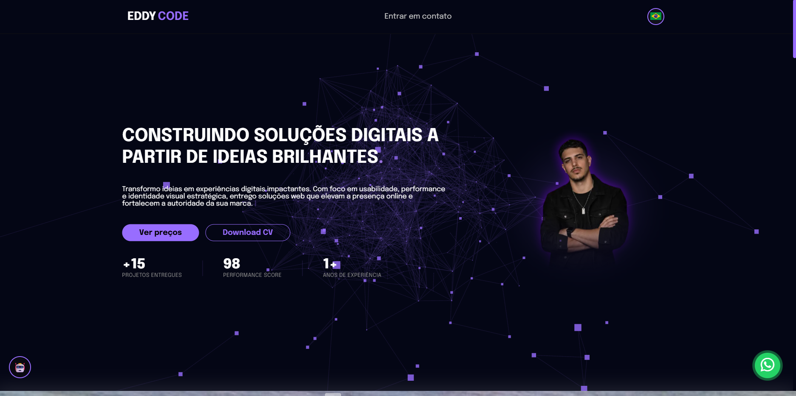

<div align="center">


# EDDYCODE — Portfolio 2.0

**A premium, high-performance developer portfolio built with vanilla JavaScript, Three.js, and modern CSS.**

[](https://your-url.vercel.app)
[](https://www.linkedin.com/in/edleson-jr-97734b1a0/)
[](https://github.com/edlesonjrr)

<br/>



</div>

---

## ✨ Overview

This is the personal portfolio of **Edleson Junior (Eddy)** — a Fullstack Developer passionate about creating impactful digital experiences. Built entirely from scratch without UI frameworks, this project reflects real-world skills in performance engineering, 3D rendering, animation, and modular front-end architecture.

> Designed to impress recruiters, attract freelance clients, and showcase technical depth in under 10 seconds.

---

## 🚀 Highlights

| Feature | Details |
|---|---|
| 🌌 **3D Hero** | Three.js particle system with 3 real Z-depth layers, mouse repulsion, camera parallax and inactivity easter egg |
| 📊 **Animated Metrics** | CountUp animation triggered by IntersectionObserver — +20 projects, 98 performance score, 3+ years |
| 🤖 **EddyBot** | Custom chatbot with keyword responses, suggestion buttons and WhatsApp integration |
| 🧭 **Career Timeline** | Retro-futuristic interactive timeline with scroll animations |
| 🗂️ **Project Modal** | 8 projects with category filters (Frontend / Backend / Fullstack) |
| ⭐ **Testimonials** | Infinite CSS-only carousel, GPU-accelerated, paused when off-screen |
| 💰 **Pricing Modal** | 3-tier pricing cards with WhatsApp CTA per package |
| 🌍 **i18n** | PT/EN language toggle with typewriter preservation |
| ⚡ **Performance** | WebP images, deferred scripts, lazy backgrounds, composite-only animations |

---

## 🛠️ Tech Stack

### Core
- **HTML5** — Semantic, accessible structure
- **CSS3** — Modular files per section, no frameworks
- **JavaScript ES6+** — Vanilla, modular, zero dependencies for UI

### 3D & Animation
- **Three.js** — Hero particle system + 3D model viewer
- **ScrollReveal.js** — Scroll-triggered entrance animations
- **CSS Keyframes** — GPU-accelerated infinite animations

### Performance
- **IntersectionObserver** — Lazy init for heavy sections
- **WebP** — All images converted and preloaded
- **`defer`** — All scripts non-blocking
- **`will-change: transform`** — Compositor-layer hints on animated elements
- **`transition: specific-property`** — No `transition: all` anywhere

### Deployment
- **Vercel** — With custom security headers (CSP, X-Frame-Options, Referrer-Policy)

---

## 📁 Project Structure

```
portfolio/
│
├── assets/
│   ├── *.webp                  # All images converted to WebP
│   ├── favicon_E.png
│   └── edlesonCV.pdf
│
├── css/
│   ├── style.css               # Global styles
│   ├── NavBar.css              # Navigation bar
│   ├── about.css               # About section
│   ├── skills.css              # Skills section
│   ├── models.css              # 3D models section
│   ├── hero-2.css              # Hero 2.0 layout & metrics
│   ├── pricing.css             # Pricing modal
│   ├── testimonials.css        # Testimonials carousel
│   ├── blog-cta.css            # Blog CTA section
│   ├── blog.css                # Blog page styles
│   └── mobile.css              # Global responsive overrides
│
├── js/
│   ├── main.js                 # Core init & ScrollReveal
│   ├── hero-particles.js       # Three.js 3-layer particle system
│   ├── hero-glow.js            # Photo glow + tilt effect
│   ├── hero-metrics.js         # CountUp animation
│   ├── hero-scroll.js          # Scroll-based hero transforms
│   ├── hero-parallax.js        # Desktop mouse parallax
│   ├── hero-inactivity.js      # Inactivity easter egg
│   ├── models-3d.js            # Lazy Three.js model viewer
│   ├── pricingModal.js         # Pricing modal logic
│   ├── testimonials.js         # Carousel pause/resume control
│   ├── blog-cta.js             # Blog CTA entrance animation
│   ├── chatbot.js              # EddyBot chatbot
│   ├── popup.js                # Projects modal + filters
│   ├── timeline.js             # Career timeline popup
│   ├── translations.js         # i18n strings (PT/EN)
│   ├── langSwitch.js           # Language toggle logic
│   ├── lazy-bg.js              # Lazy background images
│   └── mobile.js               # Mobile-specific behaviors
│
├── blog.html                   # Blog page (in development)
├── index.html                  # Main portfolio page
└── vercel.json                 # Security headers config
```

---

## ⚡ Performance Targets

| Metric | Target |
|---|---|
| SEO | 100 |
| Accessibility | 100 |
| Best Practices | 100 |
| Performance (Desktop) | 90+ |
| Performance (Mobile) | Optimizing |

All animations run on **compositor thread only** (transform + opacity).
No layout-triggering properties animated (`top`, `left`, `width`, etc.).

---

## 🧪 Getting Started

```bash
# Clone the repository
git clone https://github.com/edlesonjrr/PortifolioEddy.git

# Open locally (no build step required)
cd PortifolioEddy
open index.html

# Or use a local server for best results
npx serve .
```

> No build tools, no package managers, no bundlers. Pure web platform.

---

## 📬 Contact

| Channel | Link |
|---|---|
| 🌐 Portfolio | [eddycode.vercel.app](https://your-url.vercel.app) |
| 💼 LinkedIn | [edleson-jr](https://www.linkedin.com/in/edleson-jr-97734b1a0/) |
| 💻 GitHub | [edlesonjrr](https://github.com/edlesonjrr) |
| 📧 Email | edlesonnew@gmail.com |
| 💬 WhatsApp | [+55 81 98722-5748](https://api.whatsapp.com/send/?phone=5581987225748) |

**CNPJ:** 62.720.337/0001-20

---

## 🤝 Contributing

Suggestions and feedback are always welcome!

1. Fork this repository
2. Create a new branch: `git checkout -b my-suggestion`
3. Commit your changes
4. Open a pull request with a clear description

---

## 📝 License

This project is licensed under the **MIT License**.
See the [LICENSE](LICENSE) file for details.

---

<div align="center">

Made with 💜 by **Edleson Junior**

</div>
